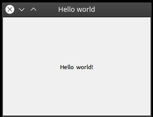
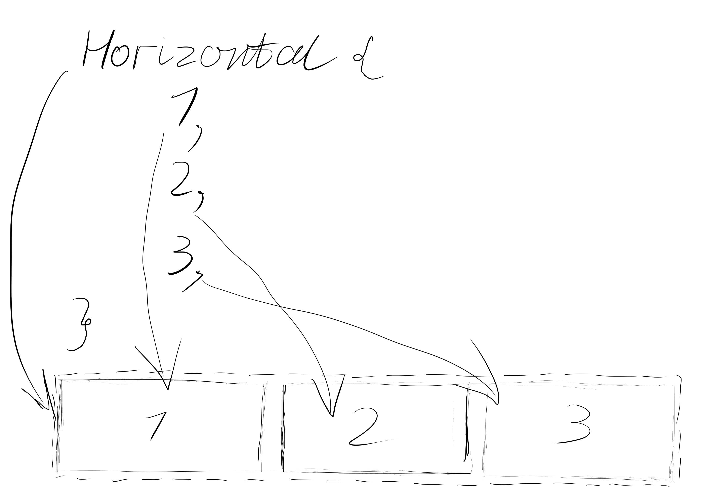
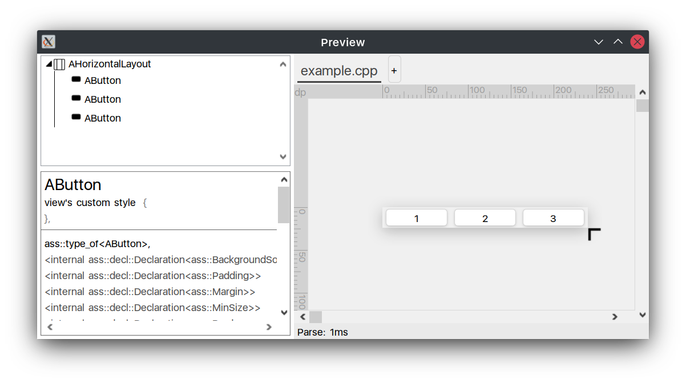
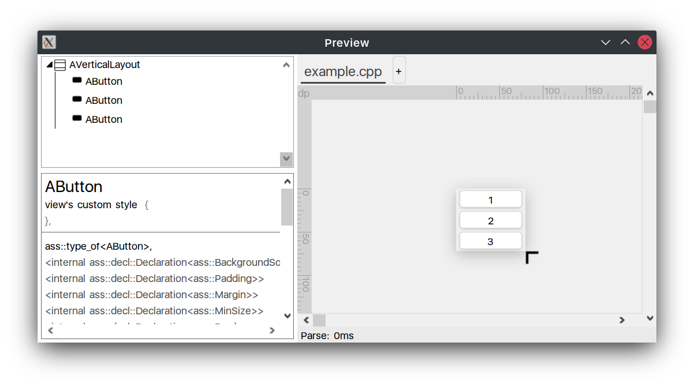
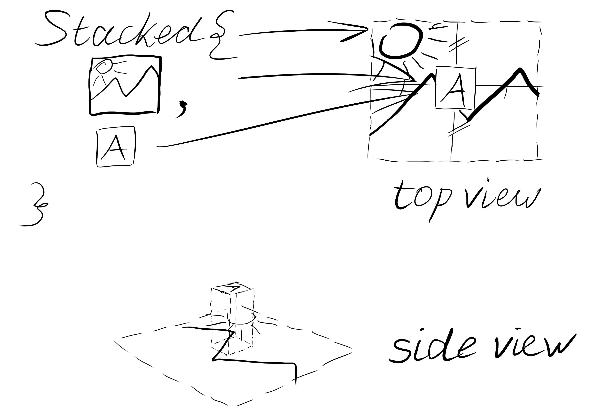
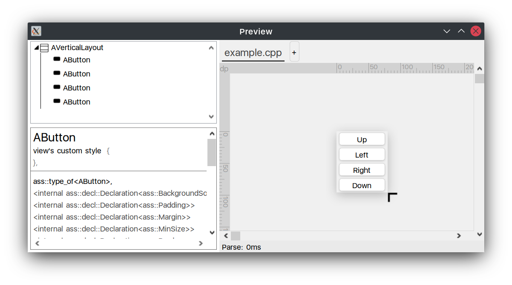
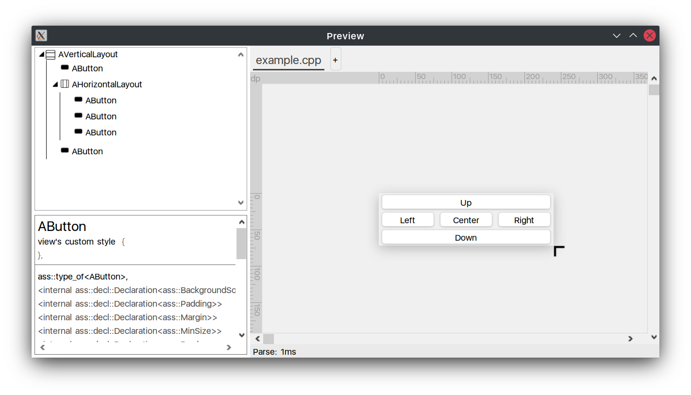
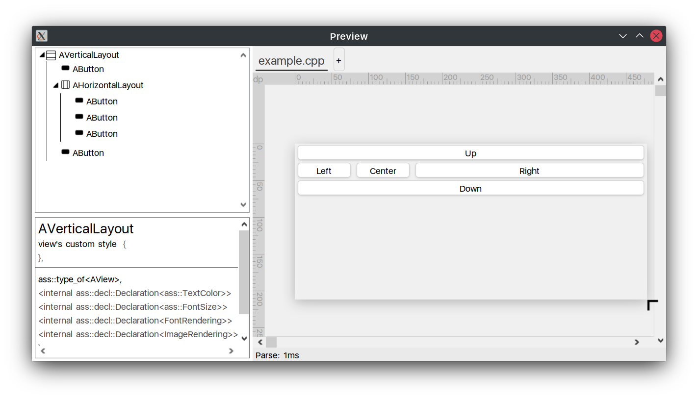
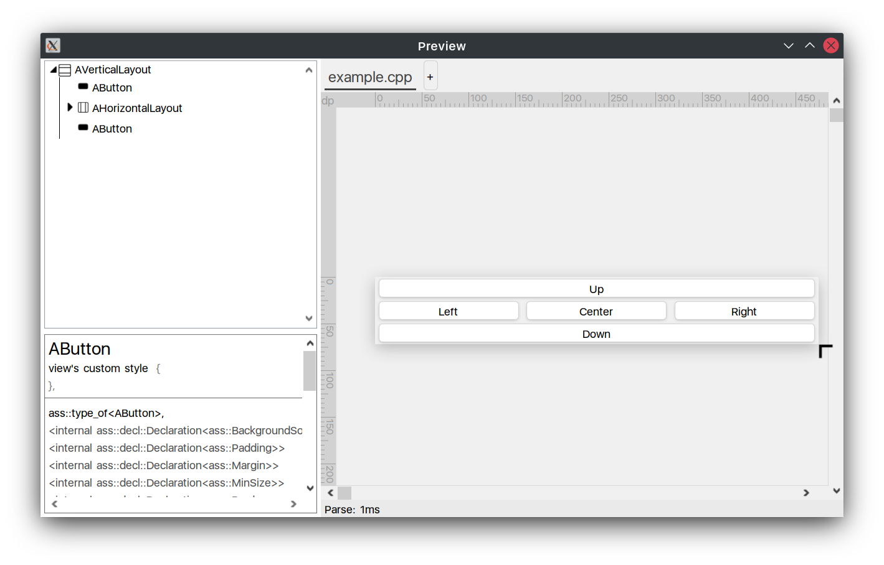
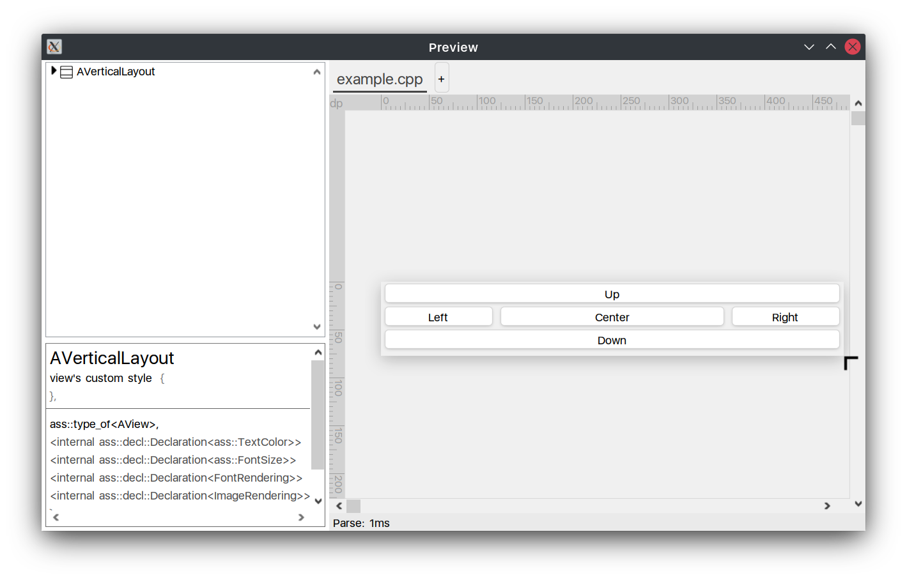

# Advanced Universal Interface manual

## Building AUI

Before to get started, you have to compile AUI.

### Windows

1. `git clone https://github.com/Alex2772/aui.git`
2. `git submodule update --init --recursive`
3. Open project's dir as source dir in cmake-gui
4. Specify build folder and install prefix (if needed)
5. Configure
6. Generate
7. Open project (button in cmake-gui)
8. Build the `INSTALL` project. It will build the library and install to your system
9. Add `<install prefix>\bin` (`C:\Program Files (x86)\AUI\bin`) to your PATH variable
10. Enjoy!

### *nix
1. Download and install cmake and gcc
2. `git clone https://github.com/Alex2772/aui.git`
3. Download dependencies: `git submodule update --init --recursive`
4. Install dependencies: `sudo apt install pkg-config libglew-dev libgtk-3-dev`
5. Create build folder and cd to it: `cd aui && mkdir build && cd build`
6. Run `cmake ..`
7. Run `make && sudo make install`
8. Enjoy!


## Basic hello world

**Project:** `projects/hello_world/basic`

Once you have compiled AUI, you can use it!

Here's the example of basic hello work application, which every AUI project AUI starts with.

`CMakeLists.txt`

```cmake
# Standard routine
cmake_minimum_required(VERSION 3.16)
project(project_template)

# Link AUI
find_package(AUI REQUIRED)

# Create the executable. This function automatically links all sources from the src/ folder, creates CMake target and
# places the resulting executable to bin/ folder.
aui_executable(project_template)

# Link required libs
target_link_libraries(project_template PRIVATE AUI.Core)
# target_link_libraries(project_template PRIVATE aui.views)
```

`src/main.cpp`

```cpp
#include <AUI/Platform/Entry.h>
#include <AUI/Logging/ALogger.h>

AUI_ENTRY {
    ALogger::info("Hello world!");
    return 0;
}
```

Building and running this project, you are getting sure that AUI built properly and you are ready to build AUI
applications!

## Graphical hello world

**Project:** `projects/hello_world/ui`

Since AUI is graphical framework it allows to easily create windows, buttons, fields without any graphical UI toolkits.

Don't forget to link to `aui.views` in `CMakeLists.txt`:

```cmake
cmake_minimum_required(VERSION 3.16)
project(graphical_example)

# Link AUI
find_package(AUI REQUIRED)

# Create the executable. This function automatically links all sources from the src/ folder, creates CMake target and
# places the resulting executable to bin/ folder.
aui_executable(graphical_example)

# Link required libs
target_link_libraries(graphical_example PRIVATE AUI.Core)
# VVVVVVVVVVVVVVVVVVV uncomment this VVVVVVVVVVVVVVVVVVVV
target_link_libraries(graphical_example PRIVATE aui.views)
```

The last line in CMake script links the aui.views module which holds all UI related functionality of the framework.

The `main.cpp` file also contains some changes:

`src/main.cpp`

```cpp
#include <AUI/Platform/Entry.h>
#include <AUI/Platform/AWindow.h>
#include <AUI/Util/UIBuildingHelpers.h>

class MyWindow: public AWindow {
public:
    MyWindow(): AWindow("Hello world", 300_dp, 200_dp)
    {
        setContents(
            Stacked {
                _new<ALabel>("Hello world!")
            }
        );
    }
};

AUI_ENTRY {
    _new<MyWindow>()->show();

    return 0;
}
```

Let's analyze this code line by line:

- `#include <AUI/Platform/Entry.h>` for `AUI_ENTRY`;
- `#include <AUI/Platform/AWindow.h>` for `AWindow`;
- `#include <AUI/Util/UIBuildingHelpers.h>` for `Stacked` and `ALabel`;
- `class MyWindow: public AWindow` we created our own window class because the `setContents` function is `protected`;
- `MyWindow(): AWindow("Hello world", 300_dp, 200_dp)` specifies window title and size, `_dp` means density independent
   screen unit (300_dp is 300 pixels with 100% DPI scale and 450 pixels with 150% DPI scale), for more info check the
   AMetric section;
- `setContents( ... )` updates the contents of the container (of the window in our case);
- `Stacked { ... }` means the container of `AStackedLayout` layout manager, basically it centers all of its children
   specified in the curly braces;
   
- `_new<ALabel>("Hello world!")` is the only child of the stacked container, `_new` is an alias for the
  `std::make_shared` function which returns `std::shared_ptr`, `ALabel` is a simple label (text on the screen),
  arguments in braces are used to construct `ALabel`;
- `_new<MyWindow>()->show();` creates a new instance of your window and pushes it to the AUI's window manager, which
  references to your window which guards your window from destruction by `std::shared_ptr`.

Please note that if any window in shown, an event loop is created after returning from the `AUI_ENTRY` function.

The example above produces the following window:



AUI supplies `aui.preview` module which is realtime previewer of UI code. It is great tool to study AUI layout build
features.

Our example in aui.preview:


Here we can see hierarchy of our UI and the UI itself. You can change the code, and it will immediately update after you
hit `CTRL+S` in your IDE.

## Layout managers

In AUI, layout building consists of layout managers. Layout manager determines position and size of container's children
views. A container is a view that consists of other views, called children. In general layout manager does not allow
going beyond the border of the container. A container can be child of a container i.e., nesting is allowed.

### Horizontal layout



Horizontal layout manager places views in a row, fitting their height to the container's height. Horizontal layout
expands last view in a row to match the right side of the container.

Example:

```c++
setContents(
    Horizontal {
        _new<AButton>("1"),
        _new<AButton>("2"),
        _new<AButton>("3"),
    }
);
```

Note: when compiling this example don't forget to include `AButton`: `#include <AUI/Views/AButton.h>`.
`aui.preview` ignores insufficient includes.



### Vertical layout


Vertical layout manager places views in a column, fitting their width to the container's width.

Example:

```c++
setContents(
    Vertical {
        _new<AButton>("1"),
        _new<AButton>("2"),
        _new<AButton>("3"),
    }
);
```




### Stacked layout

We already have encountered the first use case of stacked layout - centering. The second purpose of stacked layout is stacking
views above/below each other. In this example we have some picture as a background and a letter as some content. We want
to display letter on the background.



Also, using stacked layout we can display some overlay above application to display some dialog.


## Combining layouts

Since container can be child of other container, we can create complex UIs using basic layout managers. Let's take a
look at the example:

```c++
setContents(
    Vertical {
        _new<AButton>("Up"),
        _new<AButton>("Left"),
        _new<AButton>("Right"),
        _new<AButton>("Down"),
    }
);
```



We want to place `Left` and `Right` buttons on single row. Using nesting, it's quite simple:


```c++
setContents(
    Vertical {
        _new<AButton>("Up"),
        Horizontal {
            _new<AButton>("Left"),
            _new<AButton>("Right"),
        },
        _new<AButton>("Down"),
    }
);
```

It produces the output we want:


## Expanding and `let` syntax

Continuing example above, let's add a new button with expanding between `Left` and `Right` buttons:

```c++
setContents(
    Vertical {
        _new<AButton>("Up"),
        Horizontal {
            _new<AButton>("Left"),
            _new<AButton>("Center"),
            _new<AButton>("Right"),
        },
        _new<AButton>("Down"),
    }
);
```



Expand our form using black angle icon in the bottom right corner.



Horizontal layout manager expanded the last button in a row. We can override this behaviour specifying the views we want
to expand. To do this, call the `AView::setExpanding(vec2)` function. We need to embed `Center` button to some variable
in order to call its functions.

```c++
auto center = _new<AButton>("Center");
center->setExpanding({1, 1});
setContents(
    Vertical {
        _new<AButton>("Up"),
        Horizontal {
            _new<AButton>("Left"),
            center,
            _new<AButton>("Right"),
        },
        _new<AButton>("Down"),
    }
);
```

It's much more convenient to use AUI's `let` syntax to call some methods on object without embedding them to variables.
It is similar to Kotlin's `let` or `apply`. Inside `let` block you receive `it` variable which is object to the left of
`let` keyword.

```c++
_new<AButton>() let { it->setExpanding({1, 1}); };
```

This line is similar to

```c++
auto button = _new<AButton>();
button->setExpanding({1, 1});
```

, but you can place `let` operator inside function call or UI building. Let's finalize our example:

```c++
setContents(
    Vertical {
        _new<AButton>("Up"),
        Horizontal {
            _new<AButton>("Left"),
            _new<AButton>("Center") let { it->setExpanding({1, 0}); },
            _new<AButton>("Right"),
        },
        _new<AButton>("Down"),
    }
);
```

This code is simpler but produces the same result.

Returning to expanding, we can specify expanding to the several or all views. In this case AUI resizes your views in
fraction:

```c++
setContents(
    Vertical {
        _new<AButton>("Up"),
        Horizontal {
            _new<AButton>("Left") let { it->setExpanding({1, 0}); },
            _new<AButton>("Center") let { it->setExpanding({1, 0}); },
            _new<AButton>("Right") let { it->setExpanding({1, 0}); },
        },
        _new<AButton>("Down"),
    }
);
```



All buttons shared the space. Since we set the same expanding, they took the same space.
Left - 1/3, Center - 1/3, Right - 1/3. '3' is the sum of all expanding in the row.

We can specify the bigger expanding for the `Center` button:

```c++
setContents(
    Vertical {
        _new<AButton>("Up"),
        Horizontal {
            _new<AButton>("Left") let { it->setExpanding({1, 0}); },
            _new<AButton>("Center") let { it->setExpanding({2, 0}); },
            _new<AButton>("Right") let { it->setExpanding({1, 0}); },
        },
        _new<AButton>("Down"),
    }
);
```



Left - 1/4, Center - 2/4, Right - 1/4. '4' is the sum of all expanding in the row.

# Reference

<a name="ametric"></a>
## AMetric

Used to store dimensions in scalable units (dp, pt, etc...).

It's highly recommended to use only Density-independent Pixel unit (`_dp`) to make your application correctly handle
systems with high DPI. In AUI, all units are density independent except `_px`. The only purpose of the `_px` unit is to
define lines of exact one or two pixels wide.

### Initialization

Common usage:

```c++
AMetric a = 5_dp;
a.getValuePx() // 5 on 100% scale, 6 on 125% scale, etc
```

AMetric can be also initialized via value and unit:

```c++
AMetric a(5, T_DP);
```

AMetric can be also initialized with zero without unit specified (in this case, AMetric::getUnit will return T_PX):

```c++
AMetric zero1 = 0; // zero pixels
AMetric zero2 = {}; // also zero pixels
```

However, if you try to specify nonzero integer without unit, it will produce a runtime error:

```c++
AMetric a = 5; // runtime error
```


### Supported units

Here's table of currently supported units:

| Unit                       | Enum | Literal |
| -------------------------- | ---- | ------- |
| Density-independent Pixels | T_DP | _dp     |
| Typography point           | T_PT | _pt     |
| Pixels                     | T_PX | _px     |


## Assertions

The whole AUI framework's code filled with assertion checks so if you do something wrong the framework will tell you
about it. Also in AUI almost every assertion contains a quick tip how to solve the problem It is recommended to you to
do the same. For example:

```cpp
assert(("AAbstractThread::processMessages() should not be called from other thread",
        mId == std::this_thread::get_id()));
```

The code above ensures that the function was not called from some other thread. As you can see, the tooltip is produced
using the `operator,`:

```cpp
assert(("your message", expression))
```

Assertions work only if `CMAKE_BUILD_TYPE` set to `Debug`.

## AStylesheet

AStylesheet is a class used for applying styles on views.

### Basic usage

The example below defines a struct which constructor will be called on a program startup before the `main()` function is
called. It applies red background for all AButtons and blue border for ATextFields.

`Style.cpp`

```c++
// AStylesheet and declarations
#include <AUI/AUI/ASS.h>

#include <AUI/View/AButton.h>
#include <AUI/View/ATextField.h>

// BackgroundSolid, any<> and other declarations are in ass namespace
using namespace ass;

struct Style {
    Style() {
        AStylesheet::inst().addRules({
            // first rule
            {
                t<AButton>(),
                BackgroundSolid { 0xff0000_rgb }
            },
            
            // second rule
            {
                t<ATextField>(),
                Border { 1_px, 0x0000ff_rgb }
            },
        });
    }
} inst;
```

The benefit of using way of defining struct is a simplicity: you don't have to define all styles in a function in the
embedded file and call the function from the `main()` function. Compiler automatically places call to the constructor of
this struct before the `main()` function call.